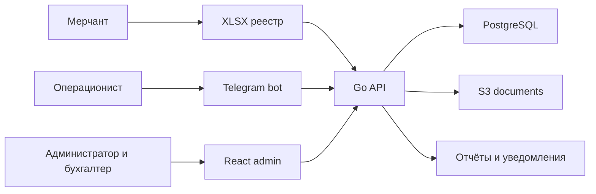

# Контекст системы

Статус: принято на высоком уровне
Дата: 2026-09-11

## Границы

- Telegram, XLSX и ручной ввод являются недоверенными источниками до валидации.
- API является единственной точкой изменения бизнес-состояния.
- PostgreSQL хранит бизнес-объекты, ledger и audit log.
- S3 хранит неизменяемые исходные документы и вложения.
- Web и bot не создают postings напрямую; они вызывают команды приложения.

## Не входит в первый релиз

- микросервисы;
- Kafka;
- Kubernetes;
- AI-распознавание свободного текста;
- прямые банковские интеграции;
- замена регламентированной бухгалтерии.
